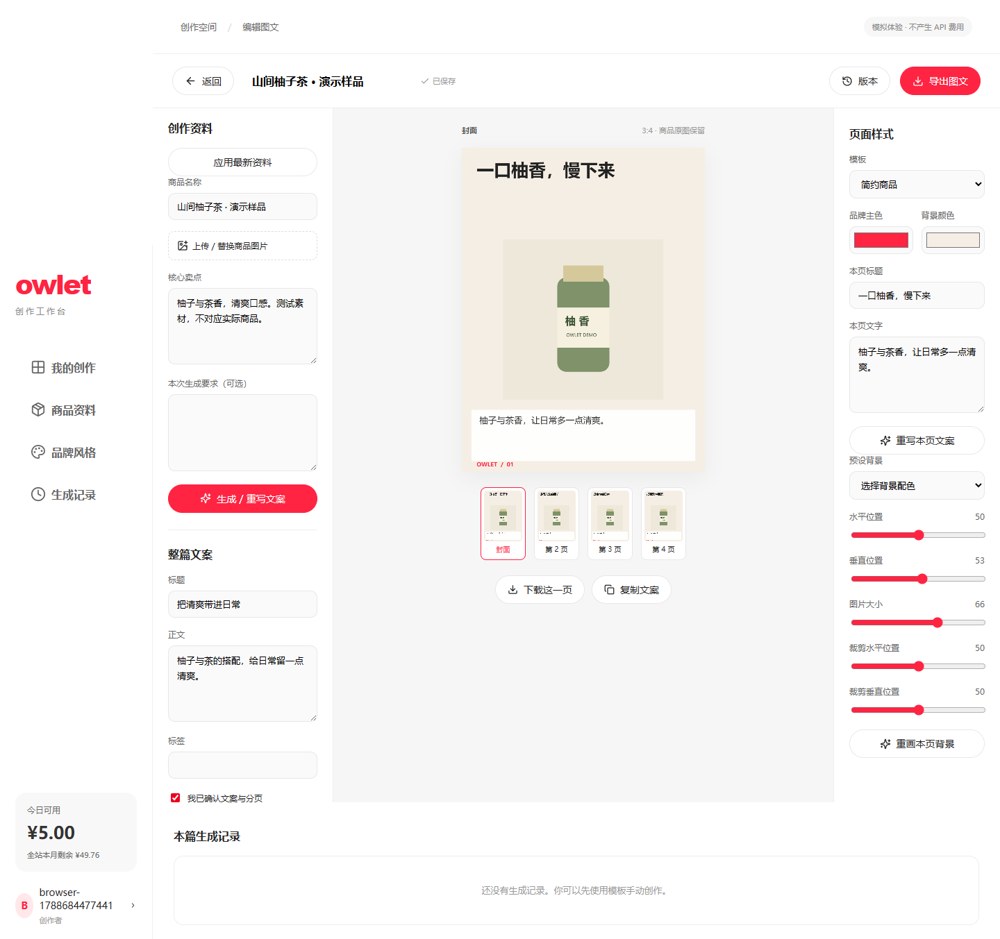

# Owlet

面向小型商家运营人员的图文创作工作台。React + TypeScript、Go、PostgreSQL；支持商品资料 → 文案 → 人工确认 → 背景 → 四页编辑导出。

已有可运行的本地与云端版本：邀请码账号、商品与品牌、三套模板、草稿与版本、PNG / ZIP 导出、持久化任务、SSE、额度账本及管理后台。2026-09-07 已部署至阿里云轻量应用服务器，正式地址为 https://owl-et.me ，HTTPS 已启用。本地默认模拟模型；线上已于 2026-09-18 完成 BigModel 文案和背景首次真实调用，模型用量与本地账本核对通过，供应商最终账单仍待核对。

## 快速启动

需要 Go 1.24+、Node.js 22、PostgreSQL 16+。实际云端使用 Ubuntu 24.04 自带 PostgreSQL 16、systemd 与 Caddy；Go 和前端在开发机编译。Compose 是备选部署方式。

1. 复制 `.env.example` 为 `.env`，设置随机数据库密码与初始管理员密码。保留 `MODEL_MODE=mock`。Go 读取环境变量，不自动加载 .env。
2. 本地数据库：`docker compose -f compose.yaml -f compose.dev.yaml up -d db`（仅向回环地址开放 5432）。
3. PowerShell 执行 `./scripts/dev-backend.ps1`，加载 .env 并运行 Go。
4. 另开终端进入 web，执行 `npm ci`、`npm run dev`，打开 http://localhost:5173 。
5. 管理员登录，在管理后台生成邀请码，再注册普通账号。

DATABASE_URL 的密码必须与数据库一致；随机十六进制密码可避免 URL 转义问题。初始管理员只在用户名不存在时创建，后续从管理后台重置密码。

本工作区另有隔离测试数据库（55432），不属于生产配置。当前演示账号 `demo-admin` / `owlet-local-demo-only` 仅用于本地环境，禁止用于上线。

## 验证

后端：设置 TEST_DATABASE_URL 指向可创建临时 schema 的测试库，进入 backend 执行 `go test -v ./...`、`go vet ./...`。数据库测试使用随机 schema 并清理自己的数据。

前端：进入 web 执行 `npm ci`、`npm run build`。前后端已启动且本地演示管理员存在时执行 `npm test`（需要 Chrome）。浏览器测试会添加测试用户及项目。`scripts/api-smoke.mjs` 同样仅用于本地演示环境。

## 资料

- [GitHub Actions：自动测试与手动部署](docs/github-actions.md)

- [真实验证记录与限制](docs/verification.md)
- [实现架构和 API](docs/architecture.md)
- [部署、计费启用与恢复](docs/deployment.md)
- [阶段进度](docs/development-plan.md)
- [需求](docs/requirements.md)
- [面试与演示提纲](docs/interview.md)
- [浏览器实录（模拟模型）](docs/demo/video.webm)
- [四页导出样本](docs/demo/four-pages.zip)

独立实现，调研项目仅作参考。没有复制小红书商标或素材，也没有本地训练或运行大模型。当前仍是邀请制演示项目，不宣称已上线或具有未经测量的吞吐量。
